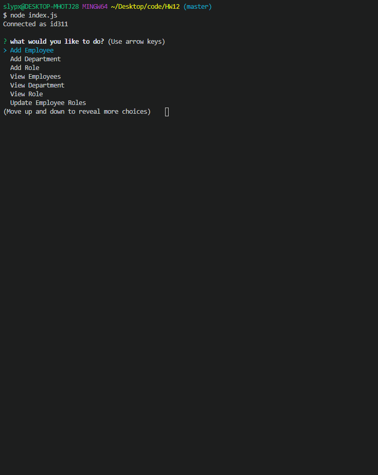

# HW12-Employee-Data-Base 
     
 
  |Table of Contents
  | -----------------                                                                                     |
  | [Description](https://github.com/TheCoaxial/HW-Professional-README-Generator#description)             |
  | [Usage](https://github.com/TheCoaxial/HW-Professional-README-Generator#usage)                         |
  | [License](https://github.com/TheCoaxial/HW-Professional-README-Generator#license)                     |
  | [Install](https://github.com/TheCoaxial/HW-Professional-README-Generator#install)                     |
  | [How to Contribute](https://github.com/TheCoaxial/HW-Professional-README-Generator#how-to-contribute) |
  | [Tests](https://github.com/TheCoaxial/HW-Professional-README-Generator#tests-required)                |
  | [Questions?](https://github.com/TheCoaxial/HW-Professional-README-Generator#questions)                |

  ## Description
  A simple database app that lets you add employees/roles/departments/and change employee roles  
  
  ## Usage
  Follow the prompts
  

  ## License
  This project uses the MIT License 
           https://opensource.org/licenses/MIT
                  
    
  ## Install
  Clone repo and create a databse with the seedfile then run index.js in node   
    
  ## How to contribute
  N/A

  ## Tests required
  N/A
    
  ## Questions?
  Github: https://github.com/Coaxial

  If you have any additional questions please email me at
  Email: thecoaxial@gmail.com

  
